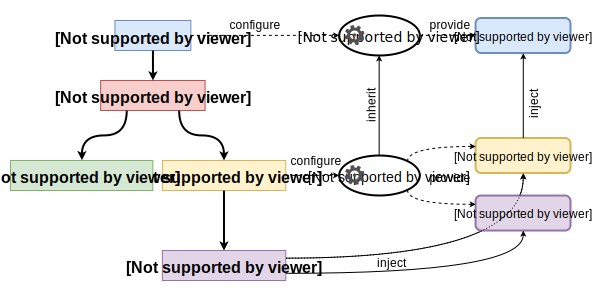

# React IoC
__Hierarchical Dependency Injection for React__

[](https://travis-ci.org/gnaeus/react-ioc)
[](https://coveralls.io/github/gnaeus/react-ioc?branch=master)
[](https://raw.githubusercontent.com/gnaeus/react-ioc/master/LICENSE)
[](https://www.npmjs.com/package/react-ioc)

## Features
 * Hierarchical Dependency Injection
 * Can inject dependencies using [React Hooks](https://reactjs.org/docs/hooks-overview.html)
 * Automatically calls `.dispose()` on created class instances when Recat unmouts `Provider` component
 * Can work without decorators
 * Supports lazy service registration with code splitting
 * ES6, CommonJS and UMD bundles
 * Declarations for TypeScript and Flow
 * Type Safe even in JavaScript (with [TypeScript `--checkJs` mode](https://github.com/Microsoft/TypeScript/wiki/Type-Checking-JavaScript-Files))
 * Tiny: only 1.1 KB (min+gzip)

### Requirements: React 16.6 or greater, ES6 Map or Map polyfill.

## Documentation


 * [@provider](#react-ioc-provider) class decorator or HOC
   * [toClass](#react-ioc-provider) binding
   * [toValue](#react-ioc-provider) binding
   * [toFactory](#react-ioc-provider) binding
   * [toExisting](#react-ioc-provider) binding
 * [@registerIn](#react-ioc-register-in) class decorator
 * [@inject](#react-ioc-inject-decorator) property decorator
 * [inject](#react-ioc-inject-function) utility function
 * [useInstance ](#react-ioc-use-instance) React Hook

### Example

```js
import React from "react";
import { provider, inject } from "react-ioc"
import { obserbvable, action } from "mobx";
import { observer } from "mobx-react";

class DataContext {
  users = observable.map<number, User>();
  posts = observable.map<number, Post>();
}

class PostService {
  @inject dataContext: DataContext;

  @action
  createPost(user: User) {
    const post = new Post({ id: uniqueId() });
    this.dataContext.posts.set(post.id, post);
    return post;
  }
}

@observer
class PostEditor extends React.Component {
  @inject postService: PostService;

  render() {
    // ...
  }
}

@provider(DataContext, PostService)
class App extends React.Component {
  render() {
    // ...
  }
}
```

<br>

#### <a name="react-ioc-provider"></a> @provider (alias @Provider)
HOC (or decorator) that registers dependencies in scope of wrapped component.  

```js
import { provider, toClass, toFactory, toValue, toExisting } from "react-ioc";

@provider(
  DataContext,                          // bind DataContext to self
  [IFooService, FooService]             // bind IFooService to FooService
  [IBarService, toClass(BarService)]    // bind IBarService to BarService
  [IBazService, toValue({ baz: 123 })]  // bind IBazService to static value

  // bind MobxStore to factory with dependencies
  [MobxStore, toFactory(
    [IFooService, IBarService],
    (fooService, barService) => MobxStore.create(fooService, barService)
  )]

  // bind IObsoleteService to already registered IFooService instance
  [IObsoleteService, toExisting(IFooService)],  
)
class App extends React.Component {
  render() {
    // ...
  }
}
```

Providers can be nested:

```js
@provider(DataContext, AuthService)
class App extends React.Component {
  render() {
    // ...
  }
}

@provider(UserService)
class HomePage extends React.Component {
  render() {
    // ...
  }
}
```

Also `Provider` component has `static register()` function, for imperative dependencies registration:

```js
// App.jsx
import { provider, toClass } from "react-ioc";

class App extends React.Component {}

export default provider()(App);
```
```js
// somewhere else
import App from "./App";

App.register(FooService, [BarService, toClass(BarService)]);
```

[▲ back to top ▲](#documentation) <br>

#### <a name="react-ioc-register-in"></a> @registerIn (alias @RegisterIn)
Class decorator for lazy service registration in `Provider`. Accepts lambda that returns some `Proveider` component.

```jsx
// ./services/LazyService.js
import { registerIn } from "react-ioc";
import App from "../components/App";

@registerIn(() => App)
export class LazyService {}
```
```jsx
// ./components/LazyWidget.jsx
import { inject } from "react-ioc";
import { LazyService } from "../services/LazyService";

export default class LazyWidget extends React.Component {
  @inject lazyService: LazyService;
}
```
```jsx
// ./components/App.jsx
import { provider } from "react-ioc";
const LazyWidget = React.lazy(() => import("./LazyWidget"));

@provider()
export default class App extends React.Component {
  render() {
    return (
      <React.Suspense fallback={<div>Loading...</div>}>
        <LazyWidget />
      </React.Suspense>
    );
  }
}
```

Also, is can accept binding as second argument:

```jsx
// ./services/LazyService.js
import { registerIn, toClass } from "react-ioc";
import App from "../components/App";

interface LazyService {
  method(): void;
}

class LazyServiceImpl implements LazyService {
  // ...
}

@registerIn(() => App, toClass(LazyServiceImpl))
export class LazyService {}
```

[▲ back to top ▲](#documentation) <br>

#### <a name="react-ioc-inject-decorator"></a> @inject (alias @Inject)
Property decorator for property dependency injection.

Can use dependency types from Reflect Metadata (with TypeScript `--emitDecoratorMetadata`):
```jsx
import { inject } from "react-ioc";

class FooService {
  @inject barService: BarSerivce;
}

class MyComponent extends React.Component {
  @inject fooService: FooService;
  @inject barService: BarSerivce;
  // ...
}
```

Or manually specified dependencies:
```jsx
import { inject } from "react-ioc";

class FooService {
  @inject(BarSerivce) barService;
}

class MyComponent extends React.Component {
  @inject(FooService) fooService;
  @inject(BarSerivce) barService;
  // ...
}
```

If you want to use dependency in `React.Component` constructor you should pass `context` argument to `super()`:
```jsx
import React from "react";
import { inject } from "react-ioc";

class MyComponent extends React.Component {
  @inject fooService: FooService;

  constructor(props, context) {
    super(props, context);
    this.fooService.doSomething();
  }
}
```

[▲ back to top ▲](#documentation) <br>

#### <a name="react-ioc-inject-function"></a> inject
Utility function for property or constructor dependency injection. Note, that for React Components we should explicitely define `static contextType = InjectorContext` (unlike with `@inject` decorator).

Property Injection:
```jsx
import { inject, InjectorContext } from "react-ioc";

class FooService {
  barService = inject(this, BarSerivce);
}

class MyComponent extends React.Component {
  fooService = inject(this, FooService);
  barService = inject(this, BarSerivce);
  
  static contextType = InjectorContext;
}
```

Constructor Injection:
```jsx
import { inject } from "react-ioc";

class OtherService {
  constructor(fooService, barService) {
    this.fooService = fooService || inject(this, FooService);
    this.barService = barService || inject(this, BarSerivce);
  }
}
```

[▲ back to top ▲](#documentation) <br>

#### <a name="react-ioc-use-instance"></a> useInstance React Hook

```jsx
import { useInstance, useInstances } from "react-ioc";

const MyButton = props => {
  const myService = useInstance(MyService);

  return <button onClick={() => myService.doSomething()}>Ok</button>
}

const MyWidget = props => {
  const [fooService, barService] = useInstances(FooService, BarService);

  return <div><MyButton /></div>
}
```

[▲ back to top ▲](#documentation) <br>

### Usage
```
> npm install --save react-ioc
```

#### UMD build
```html
<script crossorigin src="https://unpkg.com/react-ioc/dist/index.umd.min.js"></script>
```
```js
const { provider, inject } = window.ReactIoC;
```
